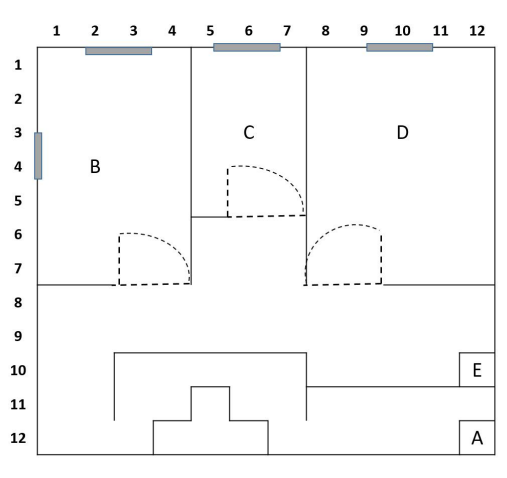
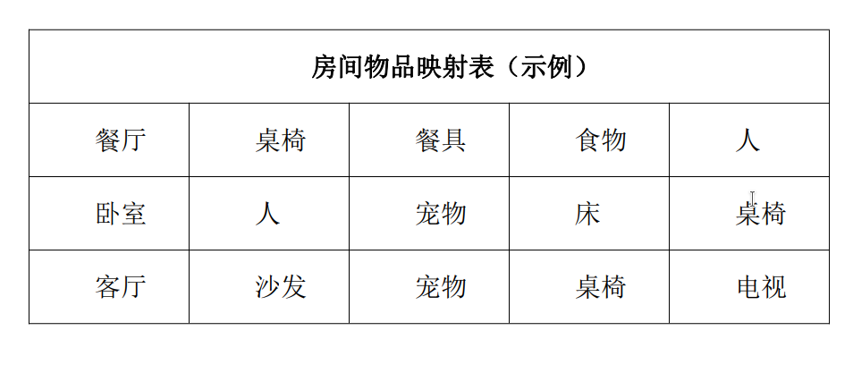

# 17th  讯飞赛题 解读

## 规则理解

> 本次比赛设定的场景为家庭服务机器人（智能车）在居家环境下，根据主人的要求，完成语音交互、房间标定、信息传递等工作。选手需根据比赛具体要求，开展智能车相关功能的调试，使其在指定场地中完成工作。

- "根据主人要求, 完成语音....":  
    语音交互任务应该就是发车和播报
- "房间标定":  
    应该就是指下文中识别房间类型
- "信息传递":  
    至少包含用摄像头进行视觉识别, 语音播报"房间标定"的结果
- "...完成工作":  
    上文中的工作为语音交互, 房间标定, 信息传递, 但还写了等, 可能还有其他内容

> 设有智能车启动区、房间识别区、停车区等组成，赛场内会随机设置数个 30cm*50cm 障碍板/小型障碍物

有除了板以外的"小型障碍物".  

- 小型障碍物的雷达扫描信号大小和其实际footprint大小一样? 障碍物的形状是什么? "小型障碍物"有没有可能是需要识别的对象?
- 是否会在比赛前公布障碍物出现位置?

> 任务交付区（E 区）：完成停车任务及语音播报任务的区域；

按这样的说法, 似乎只有停车后的语音播报房间内容, 没有更多语音交互



图上画了门, 门应该是敞开的, 没有障碍物, 宽1m, 门外可以看见房间内的很多内容  
还未进入房间就可以开始识别

图上还画了窗户, 暂时不知道会是什么情况

> 子任务 1：智能车经语音唤醒启动；

必须要用语音唤醒启动

> 子任务 2：智能车从出发区离开，移动至户型识别区(B 区),并根据识别到的信息判断房间类型；

> 任务 2、3、4 智能车完全进入区域，视为完成任务，

应该是四个轮子都进入门口的线内即可  

> 到达各房间的先后顺序可自行调整。

为什么会需要"顺序"?  
也没有说一个房间只能进入一次  

> 在任务中可语音协助小车脱困或控制小车移动，但是不可经由控制命令将比赛任务传达给小车，在停泊区禁止使用，每场不得超过3次；需将使用的命令写在操作手册中。

和去年一样, 似乎也说明了没有播报和发车以外的必要语音交互任务



## 大概策略

- case 0:  
    三个房间并非各有一个:  
    例如有两个卧室一个客厅没有餐厅  
    这不太合理, 暂时不考虑
- case 1:  
    四个物品都会出现:  
    那么只要按顺序访问房间, 在房间内巡航, 直到能够唯一确定这个房间, 离开去下一个房间
- case 2:  
    除了三个房间的类型有唯一解外, 没有出现物品的限制:  
    进入房间进行巡航

  - 解法0 (推荐):  
      用激光雷达的扫描信号定出所有板子的位置, 逐一的, 去看板子上的内容  
      如果看到了来自那块板子的内容, 去下一块板子  
      如果看到的是空的那面, 立即去看另一面, 除非看另一面不是collision free的  
      当信息能够唯一确定房间类型时候, 离开前往下一个房间  
      看完所有板子还不能确定, 离开前往下一个房间  
      > 不考虑识别的东西不是印在板子上的情况  
      > lazer detect 需要能检测出所有板子即使是靠近墙壁的  
      > 如果发生房间里放了十几快板子的情况, fallback到下面的解法

  - 解法1:  
      依次访问房间  
      当信息能够唯一确定房间类型时候, 离开前往下一个房间  
      当巡航路线结束仍然不能唯一确定房间类型, 离开前往下一个房间  

      如果探索完三个房间还是无解, 报错
      >这需要巡航路线能够快速无死角的探索完房间
  - 解法2:
      当信息能够唯一确定房间类型时候, 离开前往下一个房间  
      粗略的环视房间, 离开前往下一个房间  
      当三个房间都访问了, 仍然不能解出房间类型时, 返回距离最近或信息较少的有争议房间中, 用更细致的巡航路线来探索这个房间
      >这需要考虑航线的细致度和时间代价, 进行复杂的决策

## 详细实现

### 高层决策

使用一个节点, 通过service/action来调用检测, 导航等.  
需要知道当前房间的检测状态, 存储所有已收到的信息, 判断, 发送goal

发送goal进入房间,  
进行一次lazer_detect,  
遍历lazer_detect返回的板子,  
发送到板子前的goal,  
若返回了该板子的检测结果, 发送下一个goal,
若检测结果是空板子, 下一个goal是板子的另一面,  
如果路径规划失败, 跳过该goal,
直到房间确定或者遍历完成, 去下一个房间

每次有了新的检测结果时, 存储并判断房间标定情况

### 房间标定

六个列表:

房间B, C, D分别可能是什么, b_type, c_type, d_type
房间B, C, D分别有什么, b_contain, c_contain, d_contain

高层将检测结果发来后, 加入对应的x_contain, 并更新x_type
    如果x_type只剩一个元素 (即能够唯一确定这个房间), 更新其他两个的type, 去除这个类型, 并通知高层房间标定成功

```python
def 更新x_type(element):
    if element == 桌椅:
        pass
    elif element == 餐具:
        x_type.remove(卧室)
        x_type.remove(客厅)
    elif element == 食物:
        x_type.remove(卧室)
        x_type.remove(客厅)
    elif element == 人:
        x_type.remove(客厅)

    ...以此类推

```

### 检测板子

参考/使用`lazer_detect`  
返回一个, 当前空间内板子的位置的数组  
视资源占用常开或者由高层轮寻调用

### 视觉识别

节点常开, 但是只在被调用时检测一次
接收到检测信号后采集一定数量的图片, 以置信度作为权重进行加权平均, 忽略低于一定值的标签  
返回检测结果给高层
>有可能需要分区图像, 以确定返回的检测结果是目标板子的

### 导航

能够运动到高层发送的goal  
当路径规划失败时, 要能够通知高层节点

### 语音播报结果

> 语音播报格式为：“任务完成，B 房间为X,C 房间为Y，D 房间为 Z。”
生成每个房间的每个类型语音, 按检测结果顺序播放
